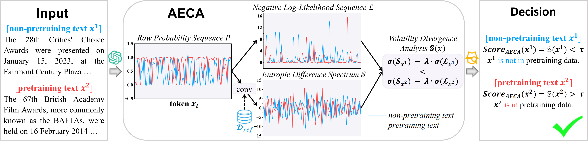

# Rethinking Pretraining Data Detection for LLMs: From Local to Global
This repository focuses on the problem of pretraining data detection for LLMs and proposes a novel method based on the **probability dynamics of tokens during the text generation process.**

## Overview
Modern LLMs owe their success to massive training datasets. However, the use of such extensive, unchecked data raises serious issues like **privacy leakage** and **data contamination**. Consequently, the ability to audit whether a target text belongs to the pretraining corpus is essential for trustworthy AI.

We propose <u>**A**</u>daptive <u>**E**</u>ntropic <u>**C**</u>onvolutional <u>**A**</u>nalysis **(AECA)**, a novel pretraining data detection framework.



## Requirements and Dependencies

Install the required dependencies using `pip`:

```bash
pip install -r requirements.txt
```

## Dataset
The datasets used in our experiments can be accessed as follows:
* **WikiMIA:** Available at [🤗swj0419/WikiMIA](https://huggingface.co/datasets/swj0419/WikiMIA).
* **MIMIR:** Available at [🤗iamgroot42/mimir](https://huggingface.co/datasets/iamgroot42/mimir).
* **Reference Corpus $\mathcal{D}_{\text{ref}}$:** Available at [🤗allenai/c4](https://huggingface.co/datasets/allenai/c4).

## Model
You can download the models used in our experiments from Hugging Face. For example:

* **Pythia-2.8b:** [🤗EleutherAI/pythia-2.8b](https://huggingface.co/EleutherAI/pythia-2.8b).
* **GPT-NeoX-20B:** [🤗EleutherAI/gpt-neox-20b](https://huggingface.co/EleutherAI/gpt-neox-20b)

## Running
Follow the steps below to reproduce the results:

1. First, configure the paths for the datasets and models in `config.py`.

2. Calculate the token frequency of the reference corpus:
    ```bash
    python build_freq.py
    ```

3. Finally, run the AECA evaluation script:
    ```bash
    python AECA.py
    ```


